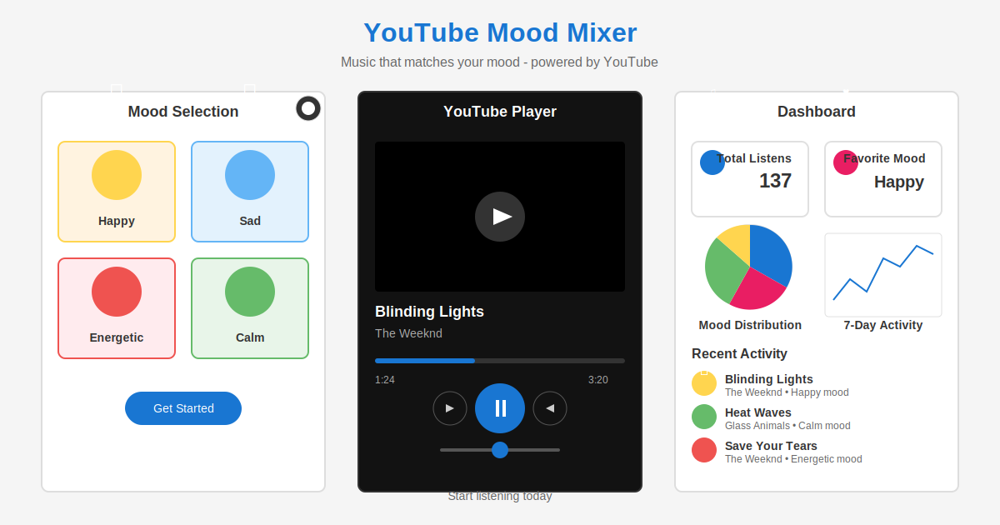

<p align="center">
  
</p>

<h1 align="center">VibeCraftr</h1>

<p align="center">
  
  
  
  
  
</p>

<p align="center">
  <a href="#overview">Overview</a> •
  <a href="#tech-stack">Tech Stack</a> •
  <a href="#features">Features</a> •
  <a href="#installation">Installation</a> •
  <a href="#environment-setup">Environment Setup</a> •
  <a href="#usage">Usage</a> •
  <a href="#development">Development</a> •
  <a href="#contributing">Contributing</a> •
  <a href="#license">License</a>
</p>



## Overview

**YouTube Mood Mixer** is a web application that creates personalized music playlists based on your current mood. Unlike traditional music services that require subscriptions, Mood Mixer leverages YouTube's vast music library to create mood-specific playlists. Simply select your mood, and the app will generate a customized music experience that matches your emotional state.

The application offers an intuitive interface for mood selection, a YouTube-powered player with smooth controls, and a dashboard to track your listening habits and preferences over time.

## Tech Stack

### Frontend
- **React 18** - UI component library
- **Vite** - Next-generation frontend tooling
- **React Router v6** - Client-side routing
- **Material UI 5** - Component library with Material Design
- **Material UI X-Charts** - Data visualization components
- **react-youtube** - YouTube player integration

### External APIs
- **YouTube Data API v3** - Access to YouTube's video catalog

### Development Tools
- **ESLint** - JavaScript linting
- **SWC** - Fast JavaScript/TypeScript compiler
- **npm** - Package management

### Design Patterns
- **Component-based architecture**
- **Custom hooks for business logic**
- **Responsive design principles**
- **Theme customization with light/dark mode**

## Features

### 🎭 Mood-Based Music Selection
- Select from various mood categories: Happy, Sad, Energetic, Calm, Focused, and Romantic
- Each mood comes with carefully selected keywords for optimal music discovery

### 🎵 YouTube Integration
- Seamless YouTube player with custom controls
- No subscription required - uses YouTube's vast music library
- Automatic playlist generation based on mood selection

### 📊 User Dashboard
- Track listening statistics and patterns
- Visualize your mood preferences with interactive charts
- View recently played tracks and activity history

### 🌓 Theme Customization
- Toggle between light and dark mode
- Color themes tailored to each mood category
- Responsive design for any device size

## Installation

1. Clone the repository:
```bash
git clone https://github.com/vara910/MusicRecommender.git
cd youtube-mood-mixer
```

2. Install dependencies:
```bash
npm install
```

3. Setup environment variables (see Environment Setup section)

4. Start the development server:
```bash
npm run dev
```

5. Build for production:
```bash
npm run build
```

## Environment Setup

1. Create a `.env` file in the root directory
2. Add the following environment variables:
```
# YouTube API Configuration
VITE_YOUTUBE_API_KEY=YOUR_YOUTUBE_API_KEY
VITE_YOUTUBE_API_URL=https://www.googleapis.com/youtube/v3

# Environment type
VITE_NODE_ENV=development
```

3. Obtain a YouTube API key by following the instructions in [youtube-api-key-setup.md](youtube-api-key-setup.md)

## Usage

### Mood Selection
1. Navigate to the Mood Player page
2. Select a mood category that matches your current emotional state
3. The app will automatically generate a playlist based on your selection

### Player Controls
- Play/Pause: Control music playback
- Volume control: Adjust volume as needed
- Skip: Move to the next track in the generated playlist

### Dashboard
- View your listening statistics
- Check your most selected mood categories
- See your recent activity and track history

### Authentication (Demo)
For demo purposes, you can log in with:
- Email: demo@example.com
- Password: password123

## Development

### Project Structure
```
youtube-mood-mixer/
├── public/                 # Static files
├── src/
│   ├── assets/             # Media files and static assets
│   ├── components/         # Reusable UI components
│   ├── context/            # React context providers
│   ├── hooks/              # Custom React hooks
│   ├── pages/              # Page components
│   ├── services/           # API service integrations
│   ├── styles/             # Global styles and theme
│   ├── utils/              # Helper functions
│   ├── App.jsx             # Main application component
│   └── main.jsx            # Application entry point
├── .env                    # Environment variables
├── .gitignore              # Git ignore file
├── index.html              # HTML entry point
├── package.json            # Project dependencies
├── README.md               # Project documentation
└── vite.config.js          # Vite configuration
```

### Scripts
- `npm run dev`: Start development server
- `npm run build`: Build for production
- `npm run lint`: Run ESLint
- `npm run preview`: Preview production build

### Adding New Features
1. Create new components in the `src/components` directory
2. Add new pages in the `src/pages` directory
3. Update routes in `App.jsx` as needed
4. Extend or modify styles in `src/styles`

## Contributing

We welcome contributions to the YouTube Mood Mixer project! Please follow these steps:

1. Fork the repository
2. Create a new branch (`git checkout -b feature/amazing-feature`)
3. Make your changes
4. Commit your changes (`git commit -m 'Add some amazing feature'`)
5. Push to the branch (`git push origin feature/amazing-feature`)
6. Open a Pull Request

Please ensure your code follows the project's coding style and includes appropriate tests.

## License

This project is licensed under the MIT License - see the [LICENSE](LICENSE) file for details.

---

<p align="center">
  Made with ❤️ by Varaprasad
</p>
